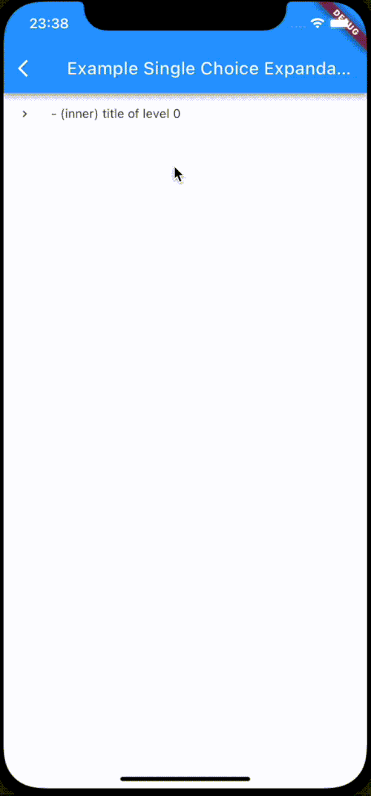

<!-- Creator: nvbien2000@gmail.com -->

# recursive_tree_flutter

Thư viện `recursive_tree_flutter` giúp xây dựng một cấu trúc dữ liệu kiểu cây và trực quan hoá chúng dưới dạng cây kế thừa (stack view hoặc expandable tree view). Đa số các thư viện tree-view tập trung vào giao diện, nhưng `recursive_tree_flutter` sẽ tập trung vào cấu trúc dữ liệu cây nên sẽ có thể đáp ứng được nhiều kiểu UI đặc biệt hơn - đó chính là điểm mạnh của thư viện này. Chẳng hạn như khả năng update cây khi một node được chọn.

## Mục lục

- [recursive\_tree\_flutter](#recursive_tree_flutter)
  - [Mục lục](#mục-lục)
  - [Tính năng](#tính-năng)
  - [Nội dung](#nội-dung)
    - [Cấu trúc dữ liệu cây (Dart code)](#cấu-trúc-dữ-liệu-cây-dart-code)
    - [Hàm phụ trợ (Dart code)](#hàm-phụ-trợ-dart-code)
    - [Cây giao diện Flutter](#cây-giao-diện-flutter)
    - [Giải thích cách hoạt động của expandable tree bất kỳ dựa trên ExpandableTreeMixin](#giải-thích-cách-hoạt-động-của-expandable-tree-bất-kỳ-dựa-trên-expandabletreemixin)
  - [BSD-3-Clause License](#bsd-3-clause-license)

## Tính năng

Một số tính năng mà thư viện này cung cấp:

- Tạo một cấu trúc dữ liệu kiểu cây (Dart code).
- Nhiều function thao tác trên cây, ví dụ như find node, search with text, update cây multiple choice...
- Cho phép mở rộng cây trong run-time (lazy-loading).
- Có thể sử dụng riêng cấu trúc dữ liệu cây tách biệt hoàn toàn với Flutter UI.
- Trực quan hoá cấu trúc cây bằng Flutter.
- Cho phép tuỳ chỉnh giao diện Flutter để phù hợp với nhu cầu sử dụng.

## Nội dung

### Cấu trúc dữ liệu cây (Dart code)

Được lấy ý tưởng từ cấu trúc của một cây thư mục trong máy tính, ta sẽ có 2 loại: thư mục và tệp. Một thư mục có thể chứa nhiều tệp và thư mục khác, và tệp là cấp độ bé nhất không thể chứa thêm gì nữa.

Tương tự cấu trúc cây thư mục trong máy tính, `recursive_tree_flutter` sẽ xây dựng một cấu trúc dữ liệu cây bao gồm inner node và leaf node.

- [AbsNodeType](lib/models/abstract_node_type.dart): Class trừu tượng cho kiểu dữ liệu của một node. Một node có thể là inner node và leaf node. Class này có các thuộc tính sau:
	- `id`: _required_, dynamic.
    - `title`: _required_, String.
    - `isInner`:  boolean, mặc định là **true**.
    - `isUnavailable`:  boolean, mặc định là **false**.
    - `isChosen`: nullable boolean, mặc định là **false**.
    - `isExpanded`: boolean, mặc định là **false**.
    - `isFavorite`: boolean, mặc định là **false**.
    - `isShowedInSearching`: boolean, mặc định là **true**. Còn được gọi là `isDisplayable`, được sử dụng nếu cây giao diện có chức năng search.
    + `clone()`: abstract method, `T extends AbsNodeType`. Cho phép clone object.
- [TreeType<T extends AbsNodeType>](lib/models/tree_type.dart): Cấu trúc dữ liệu cây.
	- `T` là Implement Class của [AbsNodeType](lib/models/abstract_node_type.dart).
    - `data`: _required_, `T`. Dữ liệu (nội dung) trong node gốc của cây hiện tại.
    - `children`: _required_, `List<TreeType<T>>`. Danh sách những cây con.
    - `parent`: _required_, `TreeType<T>?`. Cha của cây hiện tại. Nếu `parent == null`, tức là ta đang ở root của toàn bộ cây.
    - `isChildrenLoadedLazily`: boolean, mặc định là **false**. Chỉ được sử dụng nếu cây hiện tại là lazy-loading, cho biết liệu children đã được load lần nào hay chưa.
    - `isLeaf`: Cây hiện tại đang ở node lá?
    - `isRoot`: Cây hiện tại đang ở node root?
    - `clone(tree, parent)`: static method. Cho phép clone một cây.

### Hàm phụ trợ (Dart code)

- [tree_traversal_functions.dart](lib/functions/tree_traversal_functions.dart): Chứa các hàm liên quan đến duyệt cây:

    - [EChosenAllValues](lib/functions/tree_traversal_functions.dart#L4): Là kiểu `enum`, phục vụ cho các thao tác chọn/huỷ chọn trên cây, bao gồm 4 giá trị: `chosenAll`, `unchosenAll`, `chosenSome` & `notChosenable`.
    - [isChosenAll(tree)](lib/functions/tree_traversal_functions.dart#L10): Kiểm tra xem liệu các con của cây hiện tại có chọn hết, hoặc là không chọn cái nào cả, hoặc là chỉ một số được chọn, hoặc là không khả dụng.
    - [findRoot(tree)](lib/functions/tree_traversal_functions.dart#L88): Tìm gốc.
    - [findTreeWithId(tree, id)](lib/functions/tree_traversal_functions.dart#L93): Tìm cây với id dược cho.
    - [searchAllTreesWithTitleDFS(tree, text, result)](lib/functions/tree_traversal_functions.dart#L108): Tìm tất cả các cây nếu title data của root chứa searching text, dùng thuật toán DFS. Kết quả trả về được lưu trong biến `result`.
    - [searchLeavesWithTitleDFS(tree, text, result)](lib/functions/tree_traversal_functions.dart#L120): Tìm tất cả các lá nếu title data của lá chứa searching text, dùng thuật toán DFS. Kết quả trả về được lưu trong biến `result`.
    - [returnChosenLeaves(tree, result)](lib/functions/tree_traversal_functions.dart#L134): Tìm tất cả các lá được chọn. Kết quả trả về được lưu trong biến `result`.
    - [returnChosenNodes(tree, result)](lib/functions/tree_traversal_functions.dart#L148): Tìm tất cả các node được chọn. Kết quả trả về được lưu trong biến `result`.
    - [returnFavoriteNodes(tree, result)](lib/functions/tree_traversal_functions.dart#L159): Tìm tất cả các node được đưa vào danh sách yêu thích. Kết quả trả về được lưu trong biến `result`.
    - [findRightmostOfABranch(tree)](lib/functions/tree_traversal_functions.dart#L176): Tìm node **rightmost** của nhánh cây hiện tại (cây có level hiện tại trừ 1). Hàm này được sử dụng trong VTS Department Tree, dùng để xác định xem node nào nằm ở dưới cùng trong nhánh, thì leading widget của nó sẽ hơi khác biết.

- [tree_update_functions.dart](lib/functions/tree_update_functions.dart): Chứa các hàm liên quan đến cập nhập cây:

    - [updateAllUnavailableNodes(tree)](lib/functions/tree_update_functions.dart#L17): Cập nhập các giá trị `isUnavailable` của các node trong cây hiện tại. Giả sử khi ta parse data lần đầu tiên, một số lá sẽ unavailable và ta sẽ cần phải cập nhập luôn các inner node bị ảnh hưởng. Hàm trả về `true` nếu cây khả dụng (choosenable), ngược lại `false`.
    - [checkAll(tree)](lib/functions/tree_update_functions.dart#L34): check all.
    - [uncheckALl(tree)](lib/functions/tree_update_functions.dart#L46): uncheck all.
    - [updateTreeMultipleChoice(tree, chosenValue, isUpdatingParentRecursion)](lib/functions/tree_update_functions.dart#L62): Cập nhập cây (multiple choice) khi một node nào đó được tick.
    - [updateTreeSingleChoice(tree, chosenValue)](lib/functions/tree_update_functions.dart#L105): Cập nhập cây (single choice) khi một lá nào đó được tick.
    - [updateTreeWithSearchingTitle(tree, searchingText)](lib/functions/tree_update_functions.dart#L115): Update trường `isShowedInSearching` của các node khi áp dụng chức năng search.

### Cây giao diện Flutter

<!-- ***[TreeViewProperties](lib/utils/tree_view_properties.dart): Các thuộc tính được dùng chung cho các kiểu cây giao diện.*** -->

[StackWidget](lib/views/stack_widget.dart): Cây giao diện được xây dựng theo kiểu stack. Multiple choice, data được parse 1 lần duy nhất:


[StackWidget](lib/views/lazy_stack_widget.dart): Cây giao diện được xây dựng theo kiểu stack lazy-loading. Multiple choice, data được parse run-time:


[ExpandableTreeWidget](lib/views/expandable_tree_widget.dart): Cây giao diện được xây dựng theo kiểu expandable, data được parse 1 lần duy nhất:


[VTSDepartmentTreeWidget](lib/views/vts/vts_department_tree_widget.dart): Một cây giao diện khác được xây dựng theo kiểu expandable, data được parse 1 lần duy nhất:


[SingleChoiceTreeWidget](example/lib/screens/ex_tree_single_choice.dart): Một cây giao diện khác được xây dựng theo kiểu expandable, data được parse 1 lần duy nhất, single choice:


[LazySingleChoiceTreeWidget](example/lib/screens/ex_lazy_tree_single_choice.dart): Một cây giao diện khác được xây dựng theo kiểu expandable, data được parse run-time, single choice:



### Giải thích cách hoạt động của expandable tree bất kỳ dựa trên [ExpandableTreeMixin](lib/views/expandable_tree_mixin.dart)

Một cây giao diện sẽ có cấu trúc như sau:
```dart
SingleChildScrollView( // tree is scrollable
  - NodeWidget (root)
    -- NodeWidget
      +++ NodeWidget
      +++ NodeWidget
      +++ NodeWidget
    -- NodeWidget
      +++ NodeWidget
    ...
)
```
Ta có thể thấy, `NodeWidget` là `StatefulWidget` được xây dựng theo kiểu đệ quy và được bọc ngoài bởi `SingleChildScrollView` cung cấp cho cây khả năng scroll. Việc cập nhập cây (data) sẽ dẫn tới thay đổi trạng thái/UI của `NodeWidget` - có thể sử dụng `setState` hoặc `Provider` để quản lý. `NodeWidget` sẽ kế thừa [ExpandableTreeMixin](lib/views/expandable_tree_mixin.dart) (xem ví dụ ở [VTSDepartmentTreeWidget](lib/views/vts/vts_department_tree_widget.dart) dùng `setState`) với một số hàm như:
  - `initTree()`: Khởi tạo cây (data) (gọi trong `initState()`).
  - `initRotationController()`: Khởi tạo biến `rotationController` dùng để tạo hiệu ứng khi mở rộng cây UI (gọi trong `initState()`).
  - `disposeRotationController()`.
  - `buildView()`: Build giao diện của cây (đã được viết sẵn).
  - `buildNode()`: Build giao diện của một node (phải implement). Hàm này sẽ cho phép developer thoải mái custom giao diện một cách "KHÔNG THỂ TIN NỔI", trải nghiệm "KHÔNG GIỚI HẠN", nói chung là "CHẤT" :))))
  - `buildChildrenNodes()`: Build những node con với hiệu ứng animation mở rộng (đã được viết sẵn).
  - `generateChildrenNodesWidget()`: Trả về `List<NodeWidget>`, phải implement (ví dụ được ghi sẵn ở function doc).
  - `toggleExpansion()`: Xác định việc thu vào/thả ra của những node con.
  - `updateStateToggleExpansion()`: Update state sau khi thực hiện hành động thu vào/thả ra.

## BSD-3-Clause License
```
Copyright (c) 2023, Viettel Solutions

Redistribution and use in source and binary forms, with or without
modification, are permitted provided that the following conditions are met:

1. Redistributions of source code must retain the above copyright notice, this
   list of conditions and the following disclaimer.

2. Redistributions in binary form must reproduce the above copyright notice,
   this list of conditions and the following disclaimer in the documentation
   and/or other materials provided with the distribution.

3. Neither the name of the copyright holder nor the names of its
   contributors may be used to endorse or promote products derived from
   this software without specific prior written permission.

THIS SOFTWARE IS PROVIDED BY THE COPYRIGHT HOLDERS AND CONTRIBUTORS "AS IS"
AND ANY EXPRESS OR IMPLIED WARRANTIES, INCLUDING, BUT NOT LIMITED TO, THE
IMPLIED WARRANTIES OF MERCHANTABILITY AND FITNESS FOR A PARTICULAR PURPOSE ARE
DISCLAIMED. IN NO EVENT SHALL THE COPYRIGHT HOLDER OR CONTRIBUTORS BE LIABLE
FOR ANY DIRECT, INDIRECT, INCIDENTAL, SPECIAL, EXEMPLARY, OR CONSEQUENTIAL
DAMAGES (INCLUDING, BUT NOT LIMITED TO, PROCUREMENT OF SUBSTITUTE GOODS OR
SERVICES; LOSS OF USE, DATA, OR PROFITS; OR BUSINESS INTERRUPTION) HOWEVER
CAUSED AND ON ANY THEORY OF LIABILITY, WHETHER IN CONTRACT, STRICT LIABILITY,
OR TORT (INCLUDING NEGLIGENCE OR OTHERWISE) ARISING IN ANY WAY OUT OF THE USE
OF THIS SOFTWARE, EVEN IF ADVISED OF THE POSSIBILITY OF SUCH DAMAGE.
```

> **_NOTE:_**  Hoàng Sa, Trường Sa là của Việt Nam.
